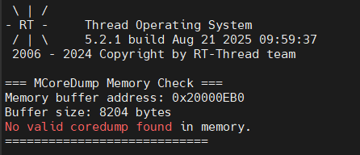
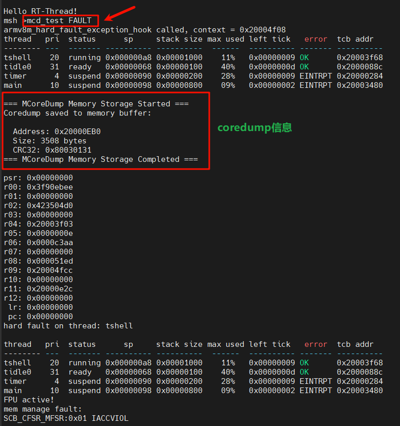
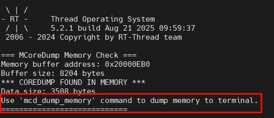
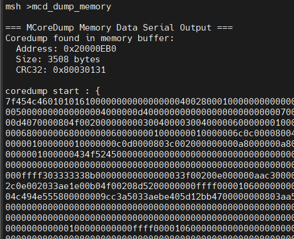
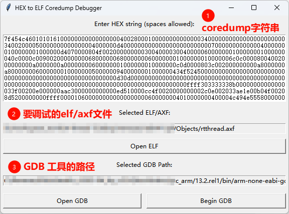
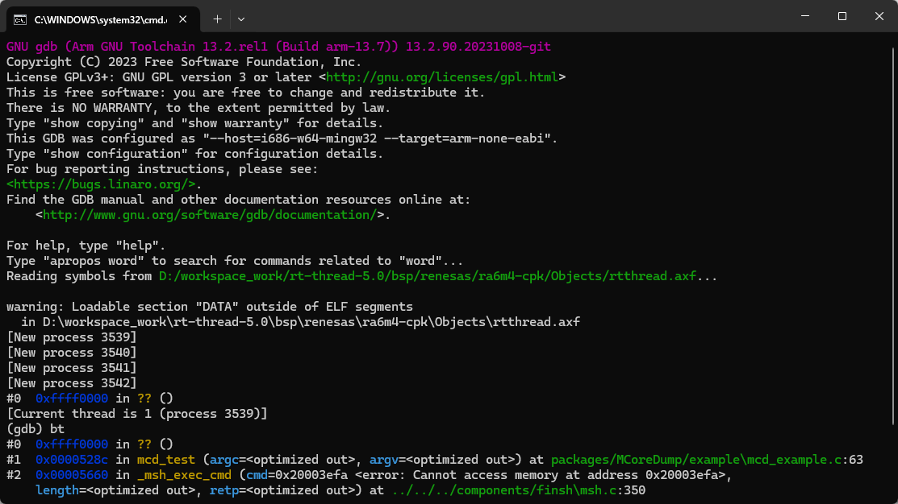
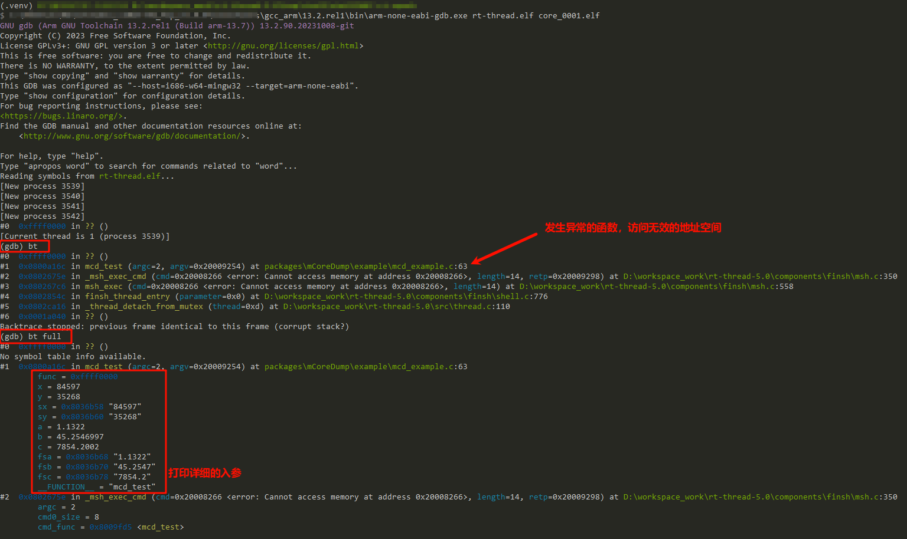
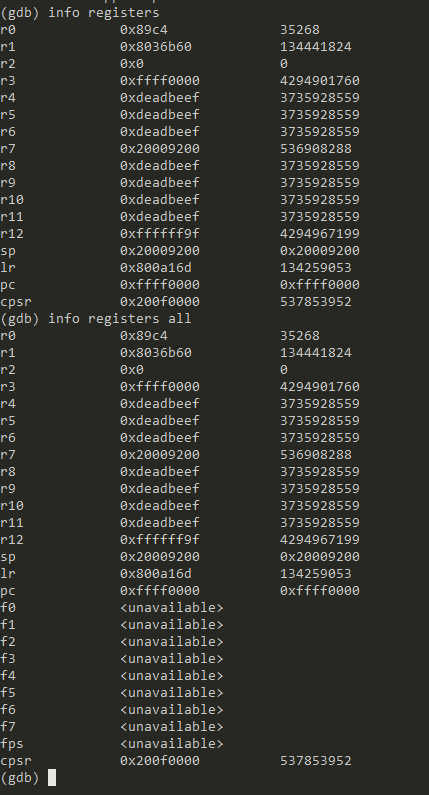
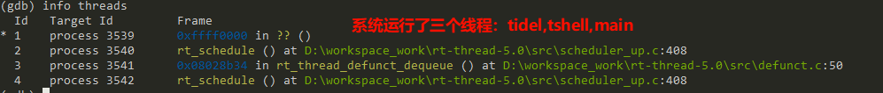

# MCoreDump - 嵌入式系统故障转储组件

> *喜欢这个项目吗？欢迎 Star ⭐️ 以帮助改进！*

## 📑 目录
- [📖 组件介绍](#-组件介绍)
- [🚀 主要特性](#-主要特性)
- [🎯 应用场景](#-应用场景)
- [✅ 支持架构](#-支持架构)
- [🏗️ 系统架构](#️-系统架构)
- [📂 目录结构](#-目录结构)
- [📦 配置选项](#-配置选项)
- [🚀 快速开始](#-快速开始)
- [📚 API 参考](#-api-参考)
  - [主要函数](#主要函数)
  - [输出模式详解](#输出模式详解)
- [🛠️ 高级配置](#️-高级配置)
- [🔧 调试工具使用](#-调试工具使用)
- [💪 如何适配新架构](#-如何适配新架构)
- [📊 性能特性](#-性能特性)
- [🐛 故障排除](#-故障排除)
- [🤝 贡献指南](#-贡献指南)
- [📄 许可证](#-许可证)


## 📖 组件介绍

MCoreDump（mini-coredump） 是专为嵌入式系统设计的故障转储（CoreDump）组件，能够在系统发生硬故障（Hard Fault）、断言失败或其他异常情况时，自动生成标准 ELF 格式的核心转储文件，用于离线调试和故障分析。

 


## 🚀 主要特性

- **🔧 ELF 格式兼容**：生成标准 ELF 格式的 core dump 文件，兼容 GDB、objdump 等调试工具

- **💾 多种输出模式**：支持串口输出、内存缓冲区存储、文件系统保存

- **🏗️ 多线程支持**：能够捕获多线程环境下所有线程的状态信息

- **⚡ 断电保持**：内存模式下数据在断电重启后仍可保持（需硬件支持）

- **🛡️ 故障安全**：采用静态内存分配，避免在故障时使用动态内存

- **📊 完整状态捕获**：包含寄存器、栈信息、内存数据等完整系统状态

  

## 🎯 应用场景

- **嵌入式系统调试**：定位硬故障、栈溢出、内存访问错误等问题
- **产品质量保证**：生产环境故障记录和分析
- **固件开发**：多线程程序调试和优化
- **现场故障分析**：设备部署后的远程故障诊断


## ✅ 支持架构

- [x] Armv7-M
- [x] Armv8-M 


## 🏗️ 系统架构

```
MCoreDump 组件架构

┌─────────────────────────────────────────────────────────┐
│                    用户层 API                            │
├─────────────────────────────────────────────────────────┤
│  mcd_faultdump() │   mcd_test   │  mcd_dump_filesystem  |
├─────────────────────────────────────────────────────────┤
│                    核心引擎层                             │
├─────────────────────────────────────────────────────────┤
│ mcd_mini_dump() │ mcd_multi_dump() │ mcd_gen_coredump() │
├─────────────────────────────────────────────────────────┤
│                    输出适配层                             │
├─────────────────────────────────────────────────────────┤
│       串口输出    │    内存缓冲区    │      文件系统        │
├─────────────────────────────────────────────────────────┤
│                    平台抽象层                             │
├─────────────────────────────────────────────────────────┤
│             RT-Thread 适配  │  架构特定代码                │
├─────────────────────────────────────────────────────────┤
│                      硬件                                │
└─────────────────────────────────────────────────────────┘
```

## 📂目录结构

MCoreDump 组件采用模块化设计：

```
MCoreDump/
├── README.md                   # 组件说明文档
├── Kconfig                     # 配置选项定义
├── SConscript                  # 编译脚本
│
├── inc/                       # 头文件目录
│   ├── mcd_cfg.h              # 配置文件和OS抽象层
│   ├── coredump.h             # 主要API声明
│   └── mcd_elf_define.h       # ELF格式定义
│
├── src/                       # 源代码目录
│   ├── coredump.c             # 核心dump生成引擎
│   ├── faultdump.c            # 故障处理和输出管理
│   └── arm/                   # ARM架构特定代码
│       ├── mcd_arm.c          # ARM架构实现（统一ARM32/64）
│       └── mcd_arm_define.h   # ARM架构定义
│
├── arch/                      # 架构抽象层
│   ├── mcd_arch_interface.h   # 架构接口定义
│   └── armv7m/                # ARM Cortex-M特定实现
│       ├── armv7m.c           # ARMv7-M寄存器收集
│       └── registers.h        # 寄存器结构定义
│
├── osal/                     # 操作系统适配层
│   └── rtthread.c             # RT-Thread特定适配代码
│
└── example/                   # 示例代码
    └── mcd_example.c          # 使用示例和测试命令
```

### 目录说明

#### 📂 核心模块

- **`inc/`** - 公共头文件
  - `mcd_cfg.h`: 配置管理和OS抽象，支持多OS兼容
  - `coredump.h`: 主要API和数据结构定义
  - `mcd_elf_define.h`: ELF文件格式相关定义

- **`src/`** - 核心实现
  - `mcoredump.c`: 核心dump生成引擎，处理ELF格式输出
  - `faultdump.c`: 故障处理入口，管理多种输出模式
  - `arm/`: ARM架构特定实现（统一管理ARM32/ARM64）

#### 📂 架构支持

- **`arch/`** - 架构抽象层
  - `mcd_arch_interface.h`: 定义架构无关的接口
  - `armv7m/`: ARM Cortex-M (ARMv7-M) 特定实现
    - 寄存器定义、异常处理、栈帧解析

#### 📂 系统适配

- **`osal/`** - 操作系统适配层
  - `rtthread.c`: RT-Thread系统的线程管理和内存操作适配

#### 📂 示例代码

- **`example/`** - 使用示例
  - 基本API使用演示
  - MSH调试命令
  - 故障触发测试

### 关键文件说明

| 文件            | 功能             | 特点                  |
| --------------- | ---------------- | --------------------- |
| `mcd_cfg.h`     | OS抽象和配置管理 | 支持多OS，统一API接口 |
| `mcoredump.c`   | ELF文件生成核心  | ELF格式处理，内存布局 |
| `faultdump.c`   | 故障处理入口     | 多输出模式，用户API   |
| `mcd_arm.c`     | ARM架构实现      | 统一ARM32/64支持      |
| `armv7m.c`      | Cortex-M特定代码 | 寄存器收集，异常处理  |
| `rtthread.c`    | RT-Thread适配    | 线程信息，系统调用    |
| `mcd_example.c` | 使用示例         | MSH命令，测试用例     |


## 📦 配置选项

### Kconfig 配置

使用 RTT ENV 工具 `menuconfig` 进入 `RT-Thread Components` → `tools packages` → `MCoreDump` 进行配置：

| 配置项 | 说明 | 默认值 |
|--------|------|--------|
| `PKG_USING_MCOREDUMP` | 启用 MCoreDump 组件 | n |
| `PKG_USING_MCOREDUMP_ARCH_ARMV7M` | 支持 ARM Cortex-M 架构 | y |
| `PKG_MCOREDUMP_MEMORY_SIZE` | 内存缓冲区大小 | 8192 字节 |
| `PKG_USING_MCOREDUMP_FILESYSTEM` | 启用文件系统支持 | n |
| `PKG_MCOREDUMP_FILESYSTEM_DIR` | 文件系统保存目录 | \"/sdcard\" |
| `PKG_MCOREDUMP_FILESYSTEM_PREFIX` | 文件名前缀 | \"core_\" |
| `PKG_USING_MCOREDUMP_EXAMPLE` | 启用示例代码 | y |

### 内存要求

- **最小 RAM**：约 10KB（包含缓冲区和代码）

- **Flash 占用**：约 15-20KB（取决于配置）

  

## 🚀 快速开始

### 🎯 适配工作

#### GCC 工具链

需要在项目的链接脚本中添加如下代码（noinit 段需要加到 bss 段前面）：

```livescript
/* Section for persistent data that survives reset (no load, no init) */
.noinit (NOLOAD) : ALIGN(4)
{
    . = ALIGN(4);
    __noinit_start__ = .;
    *(.noinit)
    *(.noinit.*)
    . = ALIGN(4);
    __noinit_end__ = .;
} > RAM1

__bss_start = .;
.bss :
{
	...
} > RAM1
__bss_end = .;
```

#### Keil 工具链（ac5/ac6）

```livescript
/* 0x2400 是coredump预留的内存空间 */
RW_IRAM2 (0x20000000 + (0x00020000 - 0x2400)) UNINIT 0x2400  {
    *(.bss.NoInit)
}
```

#### CPU 异常部分

* cortex-m3 请参考此 [PR](https://github.com/RT-Thread/rt-thread/pull/10619) 的内容进行修改
* cortex-m4 请参考此 [PR](https://github.com/RT-Thread/rt-thread/pull/10618) 的内容进行修改
* cortex-m33 请参考此 [PR](https://github.com/RT-Thread/rt-thread/pull/10624) 的内容进行修改

### 1. 启用组件

在 RT-Thread 项目中通过 menuconfig 启用 MCoreDump：

```bash
# 进入配置菜单
scons --menuconfig

# 导航到: RT-Thread Components → tools packages → MCoreDump
```

### 2. 编译和运行

```bash
# 编译项目
scons

# 烧录到目标板
# 启动系统，MCoreDump 会自动初始化
```

### 3. 基本使用

1. 系统正常启动，会自动打印 MCoreDump 相关信息，包括：coredump 缓存区起始地址，缓冲区大小

> 演示第一次启动没有触发过异常因此会显示：”No valid coredump found in memory.“

 

2. 手动输入 `mcd_test FAULT` 触发非法地址访问异常，并触发硬件 fault，此时会打印出 coredump 信息。

 

3. 芯片进行复位后，会打印 ”Use 'mcd_dump_memory' command to dump memory to terminal.“

>  由于 coredump 缓存区被定义到了 noinit 段，除非没有硬件断情况发生否则会正常的如下图所示

 

4. 此时可以在 shell 中输入 `mcd_dump_memory` 将 coredump 信息打印出来。

 

5. 工具使用：打开 `MCoreDump/tools` 下面的 `coredump.exe` 软件，下图介绍了具体功能字段信息：

 

6. 点击 **Begin GDB** 按钮，启动 GDB 调试：

 

## 📚 API 参考

### 主要函数

#### `mcd_init()` - 初始化函数
```c
void mcd_init(mcd_writeout_func_t func);
```
**功能**：初始化 MCoreDump 系统，自动检测FPU支持

**参数**：
- `func`：输出回调函数指针，用于处理 coredump 数据

**FPU检测**：
- 自动检测：基于编译器宏 `__VFP_FP__` 和 `__SOFTFP__`
- 硬件FPU：包含浮点寄存器信息
- 软件FPU：仅包含核心寄存器信息

**示例**：
```c
void my_output(uint8_t *data, int len) {
    // 处理 coredump 数据
}
mcd_init(my_output);  // 自动检测FPU
```

#### `mcd_faultdump()`
```c
int mcd_faultdump(mcd_output_mode_t output_mode);
```
**功能**：生成 coredump 并输出到指定目标

**参数**：
- `output_mode`：输出模式
  - `MCD_OUTPUT_SERIAL`：串口输出
  - `MCD_OUTPUT_MEMORY`：内存缓冲区
  - `MCD_OUTPUT_FILESYSTEM`：文件系统

**返回值**：
- `MCD_OK`：成功
- `MCD_ERROR`：失败

#### `mcd_check_memory_coredump()`
```c
rt_bool_t mcd_check_memory_coredump(void);
```
**功能**：检查内存中是否存在有效的 coredump

**返回值**：
- `RT_TRUE`：存在有效 coredump
- `RT_FALSE`：无有效 coredump

#### `mcd_print_memoryinfo()`
```c
void mcd_print_memoryinfo(void);
```
**功能**：打印 coredump 内存信息，通常在启动时调用

#### `mcd_mini_dump()` - 简化 coredump
```c
void mcd_mini_dump(void);
```
**功能**：生成当前线程的简化 coredump

**特点**：
- 仅包含当前线程信息
- 文件更小，生成更快
- 适合快速故障分析

#### `mcd_multi_dump()` - 完整 coredump（包括线程信息）
```c
void mcd_multi_dump(void);
```
**功能**：生成包含所有线程的完整 coredump

**特点**：
- 包含系统所有线程信息
- 提供完整的系统快照
- 适合深度分析

#### 尺寸计算函数
```c
int32_t mcd_mini_dump_size(void);    // 获取简化 coredump 大小
int32_t mcd_multi_dump_size(void);   // 获取完整 coredump 大小
```


### 输出模式详解

#### 1. 串口输出模式 (`MCD_OUTPUT_SERIAL`)

```c
// 直接输出 coredump 到串口
mcd_faultdump(MCD_OUTPUT_SERIAL);
```

**特点**：
- 实时输出，无需额外存储空间
- 输出十六进制格式，带 CRC32 校验
- 适合实时调试和分析

**输出格式**：
```
coredump start : {
7f454c46010101000000000000000000...
} coredump end
crc32 : 12345678
```

#### 2. 内存缓冲区模式 (`MCD_OUTPUT_MEMORY`)

```c
// 保存到内存缓冲区
mcd_faultdump(MCD_OUTPUT_MEMORY);

// 检查和读取
if (mcd_check_memory_coredump()) {
    mcd_dump_memory_to_serial();
}
```

**特点**：
- 数据持久保存（断电保持）
- 缓冲区大小可配置
- 带完整性校验（CRC32）
- 适合现场故障记录

#### 3. 文件系统模式 (`MCD_OUTPUT_FILESYSTEM`)

```c
// 保存到文件系统
mcd_faultdump(MCD_OUTPUT_FILESYSTEM);

// 从内存保存到文件
mcd_dump_filesystem();
```

**特点**：
- 生成标准 ELF 文件

- 支持时间戳命名

- 可用标准调试工具分析

- 需要文件系统支持

  

## 🛠️ 高级配置

### 自定义输出函数

```c
void my_custom_output(uint8_t *data, int len) {
    // 自定义数据处理逻辑
    // 例如：网络传输、专用存储等
}

// 新版本：自动FPU检测初始化（推荐）
mcd_init(my_custom_output);
```

### 内存缓冲区配置

在 `rtconfig.h` 中或通过 Kconfig 设置：

```c
#define PKG_MCOREDUMP_MEMORY_SIZE    (16 * 1024)  // 16KB 缓冲区
```

### 文件系统路径配置

```c
#define PKG_MCOREDUMP_FILESYSTEM_DIR     \"/data/coredump\"
#define PKG_MCOREDUMP_FILESYSTEM_PREFIX  \"crash_\"
```

## 🔧 调试工具使用

### 使用 GDB 分析

1. **获取 coredump 内容**：
```bash
# 模拟异常情况：

msh />mcd_test FAULT
thread           pri  status      sp     stack size max used left tick   error  tcb addr
---------------- ---  ------- ---------- ----------  ------  ---------- ------- ----------
tshell            20  running 0x000000d4 0x00001000    13%   0x00000008 OK      0x20006e28
mmcsd_detect      22  suspend 0x000000c4 0x00000800    51%   0x00000001 EINTRPT 0x20004d68
tidle0            31  ready   0x0000008c 0x00000400    16%   0x00000005 OK      0x20005878
main              10  suspend 0x000000d4 0x00000800    56%   0x0000000c EINTRPT 0x20005fc0

=== MCoreDump Memory Storage Started ===
Coredump saved to memory buffer:

  Address: 0x20000EF4
  Size: 3644 bytes
  CRC32: 0x86517DA7
=== MCoreDump Memory Storage Completed ===

# -------------------------------------软复位芯片-------------------------------------

 \ | /
- RT -     Thread Operating System
 / | \     5.2.1 build Aug 19 2025 13:50:55
 2006 - 2024 Copyright by RT-Thread team

=== MCoreDump Memory Check ===
Memory buffer address: 0x20000EF4
Buffer size: 8208 bytes
*** COREDUMP FOUND IN MEMORY ***
Data size: 3644 bytes
Use 'mcd_dump_filesystem' command to save to file.
Use 'mcd_dump_memory' command to dump memory to terminal.
File counter: 0 (next file will be 0001)
============================

[I/SDIO] SD card capacity 31166976 KB.
[I/SDIO] sd: switch to High Speed / SDR25 mode

found part[0], begin: 1048576, size: 29.739GB
[I/app.filesystem] SD card mount to '/sdcard'
msh />
msh />mcd_dump_filesystem
Creating coredump file: /sdcard/core_0001.elf
Coredump file opened successfully (fd: 3)
Saving coredump from memory to file: /sdcard/core_0001.elf
Coredump saved successfully to: /sdcard/core_0001.elf
msh />
msh /sdcard>ls
Directory /sdcard:
core_0001.elf       3736
```

2. **GDB 分析**（需要使用高版本 gcc 工具链，实测 >= 13.2）：
```bash
# 启动 GDB + 加载 coredump
D:\...\gcc_arm\13.2.rel1\bin\arm-none-eabi-gdb.exe rt-thread.elf core_0001.elf

# 查看崩溃位置
(gdb) bt

# 查看寄存器
(gdb) info registers

# 查看所有寄存器
(gdb) info registers all
```



查看寄存器内容：

 

 查看系统线程信息：

 


## 💪 如何适配新架构

以 ARMV7-M 为例：

1. 实现 `rt_hw_exception_install` 传入异常发生时的栈帧
2. `packages\MCoreDump\arch` 下新增架构文件夹，需要在 `armv7m.c`  中实现 `armv7m_hard_fault_exception_hook`，
3. 在 `armv7m.c` 中实现 `collect_registers_armv7m` 函数，实现对 coredump 结构体成员赋值
4. `packages\MCoreDump\osal\rtthread.c` 中新增 `arch_hard_fault_exception_hook` 声明，调用关系：`rtt_hard_fault_exception_hook`—>`arch_hard_fault_exception_hook`
5.  `mcd_get_regset`实现：把当前 CPU 的一组核心寄存器快照写入由 `regset` 指向的内存区，按约定的顺序保存
6. `mcd_multi_dump` 实现：用于收集当前 CPU 寄存器快照（core + 可选 FPU），再调用 RTOS 相关回调收集多线程信息，最后生成 core dump。与 `mcd_mini_dump` 的主要差别在于：`mini` 只准备单一线程/最小信息，`multi` 会通过 `mcd_rtos_thread_ops` 收集多线程/RTOS 信息然后生成完整 coredump
7. `packages\MCoreDump\arch\armv7m\registers.h` 中需要实现对应架构的栈帧（r0-r15，xpsr）


## 📊 性能特性

| 指标 | 值 | 说明 |
|------|----|----- |
| 单线程 coredump 时间 | < 100ms | 不包含 I/O 时间 |
| 多线程 coredump 时间 | < 500ms | 取决于线程数量 |
| 内存占用 | 8-64KB | 可配置缓冲区大小 |
| Flash 占用 | 15-20KB | 包含完整功能 |
| 支持线程数 | 无限制 | 受内存大小限制 |

## 🐛 故障排除

#### Q1: GDB 报错  “Core file format not supported”

请使用 gdb-multiarch 或 更高版本 arm-none-eabi-gdb。

#### Q2：控制台打印 “Failed to create coredump file”

请确认 SD 卡 在成功挂载；

可使用 ls / 命令确认文件系统目录是否可见。

#### Q3: 系统启动后提示 “elm mount filesvstem failed!”

存储介质需要格式化为 FAT32 格式，可以在系统启动后输入`mkfs -t elm sd0`命令进行格式化。格式化成功后，重启系统，控制台打印 `elm file system initializated!`

注意：格式化会删除SD卡中的所有文件，请谨慎使用！！！

### 调试技巧


## 🤝 贡献指南

欢迎⭐支持此项目，欢迎参与 MCoreDump 组件的开发和改进！

### 开发环境

- RT-Thread 开发环境
- 交叉编译工具链

## 📄 许可证

本项目采用 Apache 2.0 许可证。详见 [LICENSE](LICENSE) 文件。

